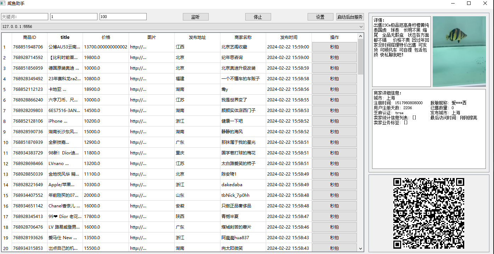
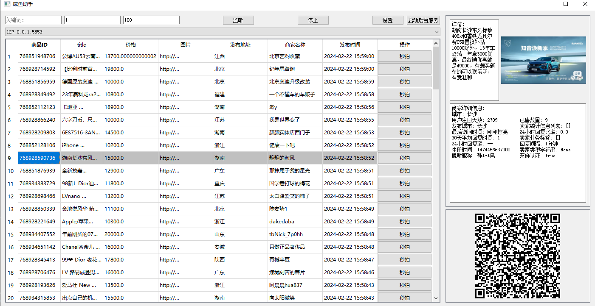
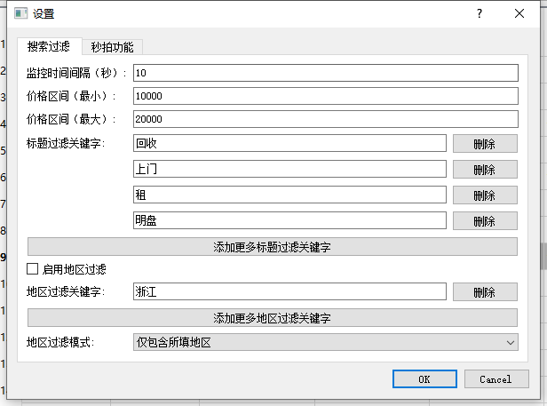
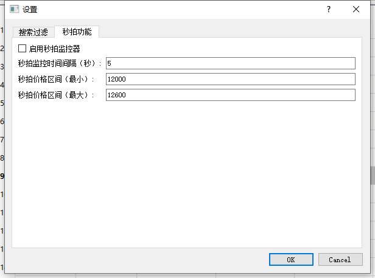

# xianyu_GUI
闲鱼商品搜索监控加秒拍，windows 端

## 运行界面

监听按钮可以监控最新发布消息，可以根据关键字监控

闲鱼扫描二维码可以跳转商品链接

秒拍按钮可以直接拍下对应商品（需要账号登录）

可以设置地区以及关键字过滤商品，打开秒拍监控在设置的价格区间内实现自动拍下

## 使用
使用该产品需配合模拟器（真机）登录闲鱼账号，不登录无法获取最新信息

## 联系
需要源码或需要可执行程序可联系我
QQ：1270445316(需注明来意)

## 免责声明
感谢您使用本程序的开源代码/程序。在下载和使用此代码/程序之前，请仔细阅读并理解以下声明。

保护知识产权：本程序的开源代码受版权法和相关法律的保护。作者享有其代码的所有权利，包括但不限于著作权、专利权和商标权。未经作者许可，禁止以任何形式侵犯这些权益。
学习交流目的：本程序的开源代码仅供学习和交流使用。下载者应将其用途限定在个人研究、学习或非商业项目中。严禁将本代码用于任何违法、侵权、破坏性或其他有害行为。
法律合规性：下载者应遵守所在地的法律法规，并承担使用本代码所产生的一切法律责任。对于因使用本代码引起的任何损失或法律纠纷，作者概不负责。
删除义务：下载者同意，在下载、使用或停止使用本程序的开源代码后，应在24小时内彻底删除该代码/程序及其衍生物。此举旨在保护作者的知识产权和隐私。
免责声明的限制：本免责声明不排除或限制适用于法律规定的任何责任。在适用法律允许的最大范围内，作者不对使用本程序代码所导致的任何直接或间接损害承担责任
请务必仔细阅读并理解以上声明。下载、使用本程序的开源代码或软件即表示您同意遵守上述规定并承担相应的法律责任。

